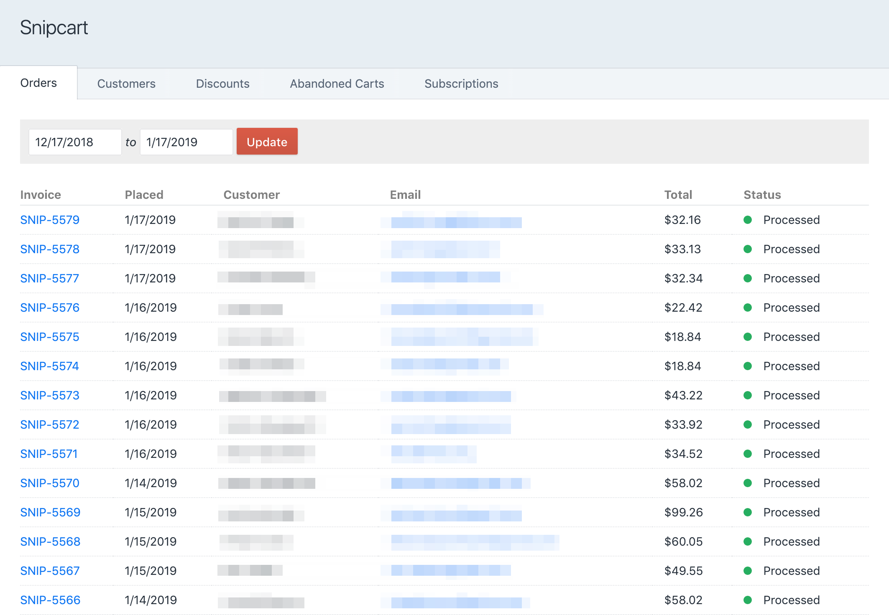
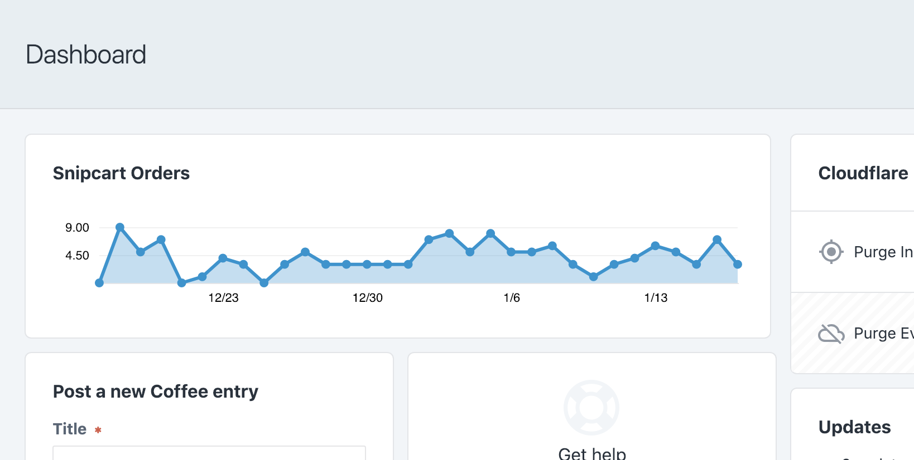

# Snipcart Plugin for Craft CMS


One of the best things about [Snipcart](https://snipcart.com/) is how quickly it can be used to turn *any* site into a working store. **You don't even need this plugin to integrate with Snipcart,** it'll just help you get started faster and integrate more deeply later on.

[[toc]]

## Features

#### Quick store setup with convenient template tags and an optional Product Details field.


```twig
{# include Snipcart JS #}
{{ craft.snipcart.cartSnippet }}

{# View Cart #}
{{ craft.snipcart.cartLink }}

{# Buy Now #}
{{ entry.productDetails.getBuyNowButton() | raw }}

{# Buy Now button with custom options #}
{{ entry.productDetails.getBuyNowButton({
   'customOptions': [
       {
           'name': 'Color',
           'required': true,
           'options': [ 'blue', 'green', 'red', 'pink' ]
       }
   ]
}) | raw }}

```

#### Browse Snipcart orders, customers, and subscriptions from the Craft control panel.



#### View up-to-date sales statistics from the Craft dashboard.



#### Issue refunds and set up discounts from the Craft control panel.


#### Easily write your own code to respond to [more than ten different events](/dev/events.md). Manage your own shipping rates, inventory, and email notifications.

```php
Event::on(
    Shipments::class,
    Shipments::EVENT_BEFORE_RETURN_SHIPPING_RATES,
    function(WebhookEvent $event) {
        $event->rates = $this->modifyShippingRates(
            $event->rates,
            $event->order,
            $event->packaging
        );
    }
);
```

#### Get nice-looking admin order emails.


