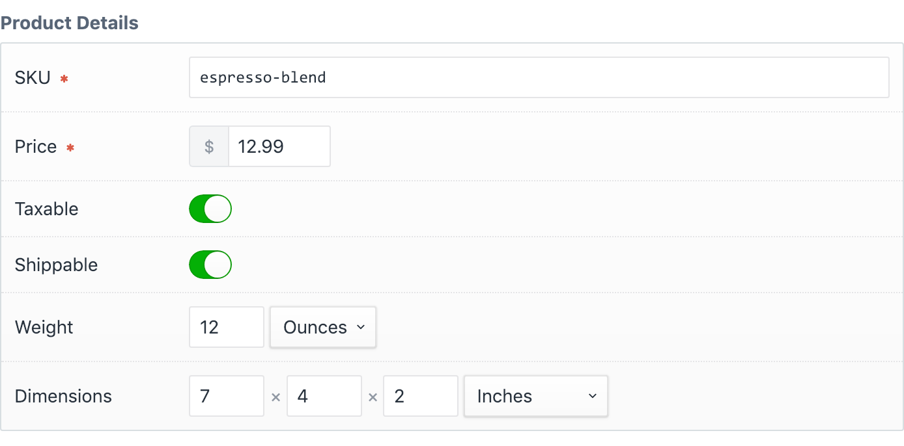
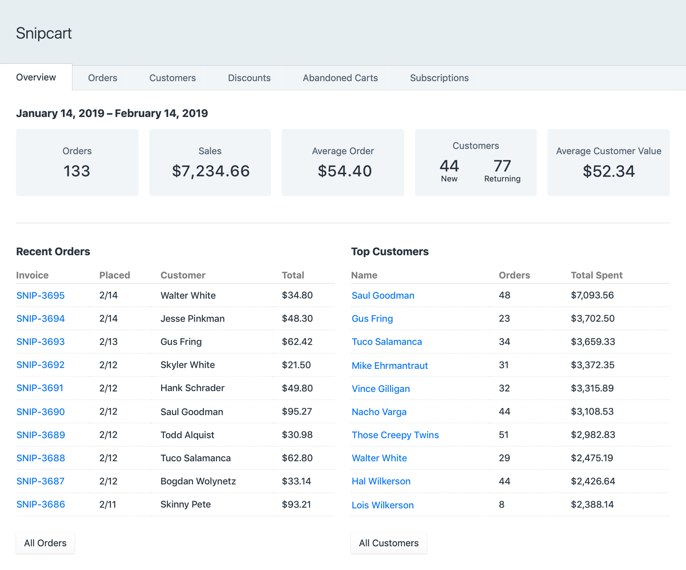
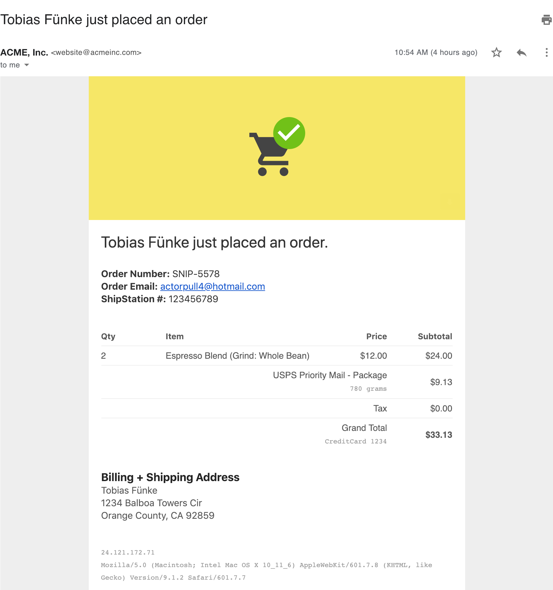

---
meta:
    - name: description
      content: Plugin setup guide, examples, and reference.
---

# Snipcart Plugin for Craft CMS


One of the best things about [Snipcart](https://snipcart.com/) is how quickly it can be used to turn _any_ site into a working store. The Snipcart plugin will help you get your store running even faster with Craft CMS and integrate more deeply, even if you've never used Snipcart.

[[toc]]

## Features

### Super fast store setup.

Use the included _Product Details_ field type and automatically handle things like unit conversion and quantity adjustment.



Add the cart system to your frontend, a cart link with an item count, and [simple or complex _Buy Now_ buttons](/templating/fields.md) with included Twig tags.

```twig
{# include Snipcart JS #}
{{ craft.snipcart.cartSnippet }}

{# View Cart #}
{{ craft.snipcart.cartLink }}

{# Buy Now #}
{{ entry.productDetails.getBuyNowButton() | raw }}

{# Buy Now button with custom options #}
{{ entry.productDetails.getBuyNowButton({
   'customOptions': [
       {
           name: 'Color',
           required: true,
           options: [ 'Blue', 'Green', 'Red' ]
       }
   ]
}) | raw }}

```

### Browse store details from control panel.

Control panel section with sales stats, orders, customers, discounts, abandoned carts, and subscriptions.



Customizable Dashboard widget.


### Create discounts and refund orders from the control panel.


### Email custom order notifications.

Use included store [admin and customer order notifications](/setup/notifications.md), optionally using your own Twig templates. You can also [hook into events](/dev/events.md) to send notifications (email, Slack, etc.) for whatever you want!



### Add custom functionality with powerful webhooks.

Integrate your own store logic with [more than ten different events](/dev/events.md). Manage shipping rates, inventory, and email notifications, and more.

```php
Event::on(
    Shipments::class,
    Shipments::EVENT_BEFORE_RETURN_SHIPPING_RATES,
    function(WebhookEvent $event) {
        $event->rates = $this->modifyShippingRates(
            $event->rates,
            $event->order,
            $event->packaging
        );
    }
);
```

## Commerce Comparison

The Snipcart plugin is great for stores that don't require the full complexity of Commerce, but would be too limited by Commerce Lite.

|                                                         | Snipcart Plugin | Commerce Lite | Commerce Pro                                                |
| ------------------------------------------------------- | --------------- | ------------- | ----------------------------------------------------------- |
| Price                                                   | \$179\*         | \$199         | \$999                                                       |
| Products                                                | ✓               | ✓             | ✓                                                           |
| Subscriptions                                           | ✓               | ✓             | ✓                                                           |
| Custom Payment Gateways                                 | ✓\*\*           | ✓             | ✓                                                           |
| Custom Checkout Process                                 | ✓\*\*\*         | ✓             | ✓                                                           |
| Taxes & Shipping                                        | ✓               | ×             | ✓                                                           |
| Shopping Cart                                           | ✓               | ×             | ✓                                                           |
| Multi-Step Checkout Flow                                | ✓               | ×             | ✓                                                           |
| Sales & Discounts                                       | ✓               | ×             | ✓                                                           |
| Digital Products                                        | ✓               | ×             | ✓                                                           |
| Live Tax & Shipping Rates                               | ✓               | ×             | ×                                                           |
| [ShipStation](https://www.shipstation.com/) Integration | ✓               | ×             | [+ plugin](https://plugins.craftcms.com/shipstationconnect) |

<small>\*</small> Snipcart is a hosted service with [its own service fee](https://snipcart.com/pricing).  
<small>\*\*</small> [Snipcart supports more gateways](https://snipcart.com/list-ecommerce-payment-gateways) [than Commerce](https://docs.craftcms.com/commerce/v2/payment-gateways.html), but Commerce plugins can add more.  
<small>\*\*\*</small> Snipcart offers a customizable cart template you can tailor however you'd like.
