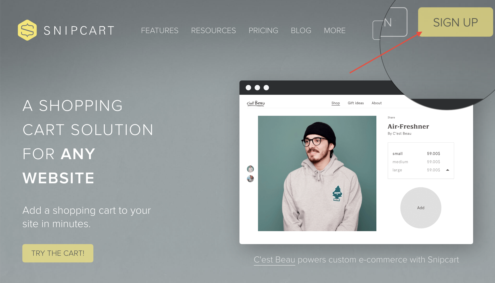
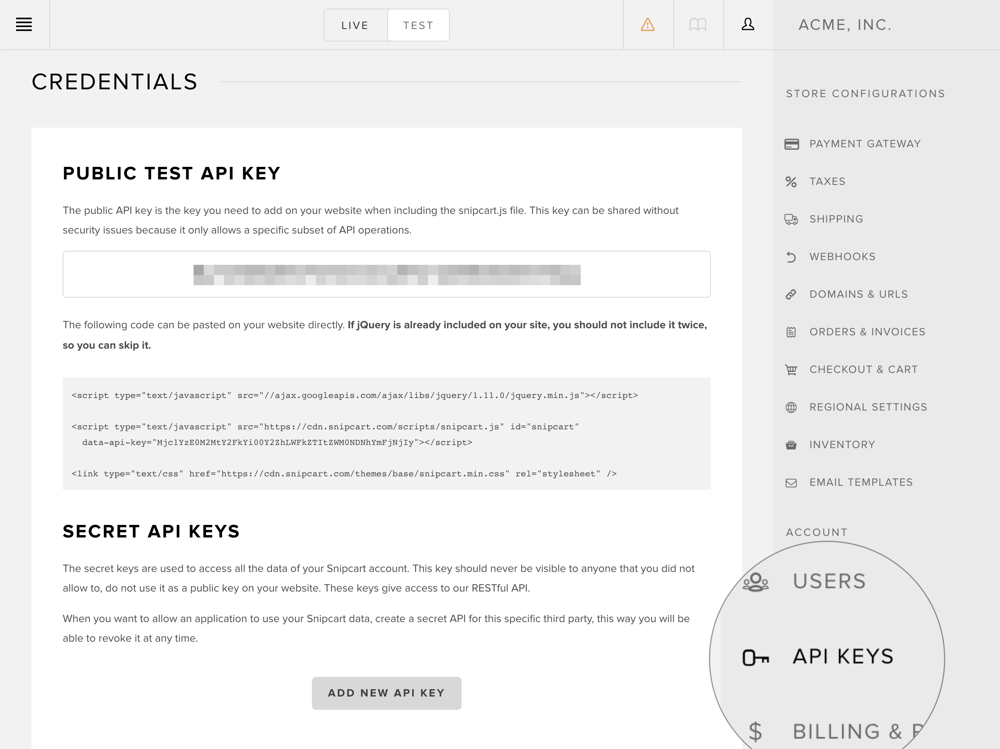
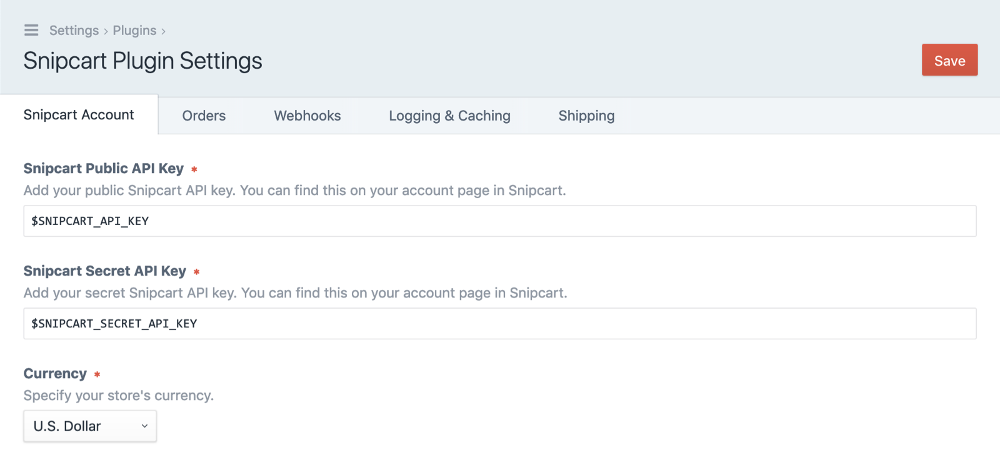
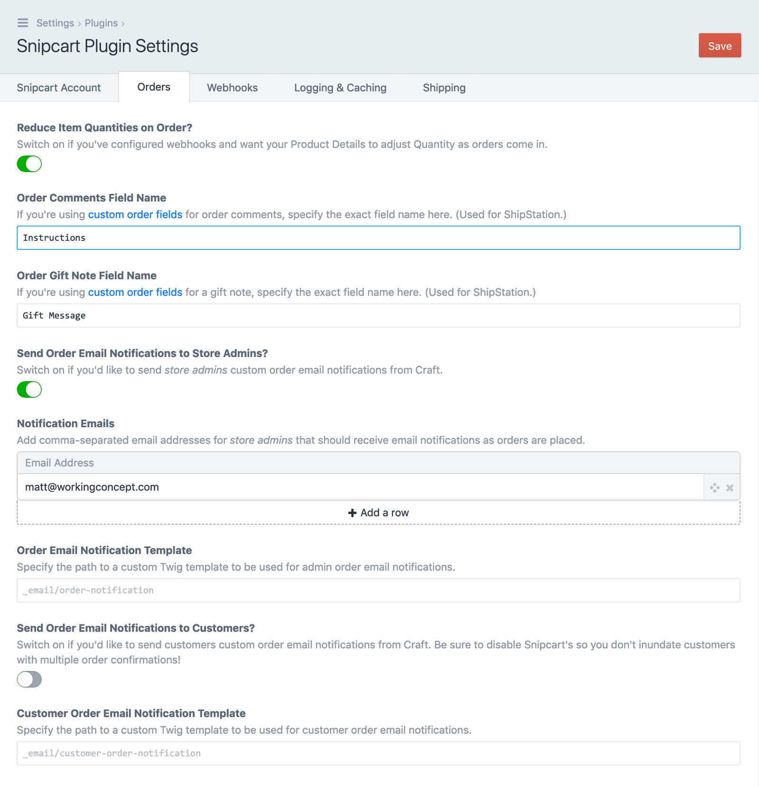
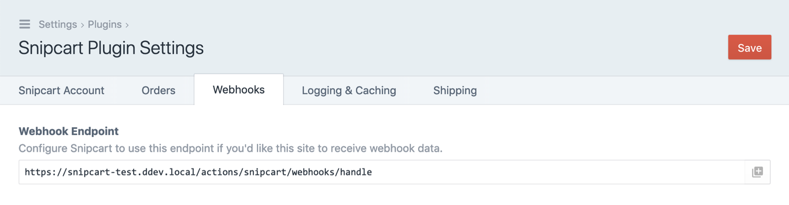
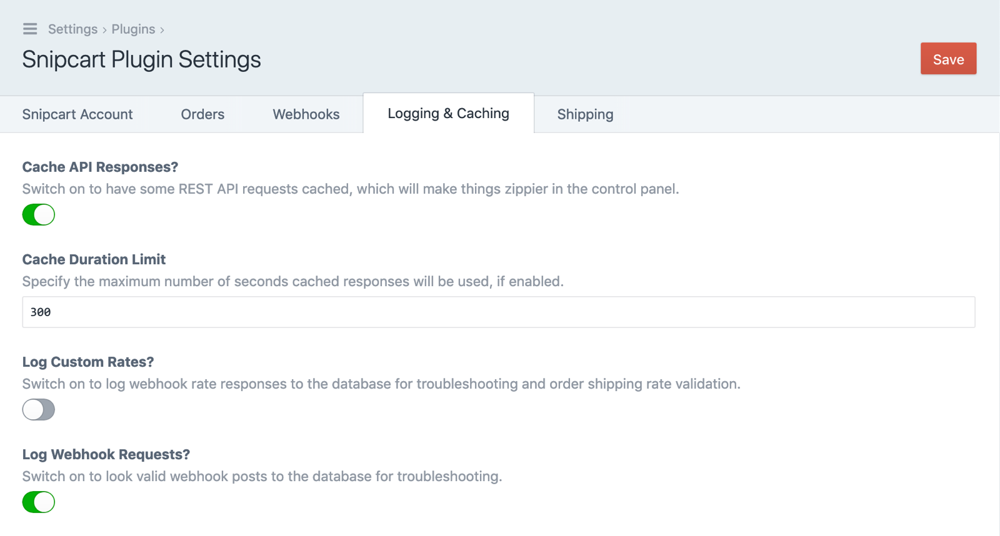
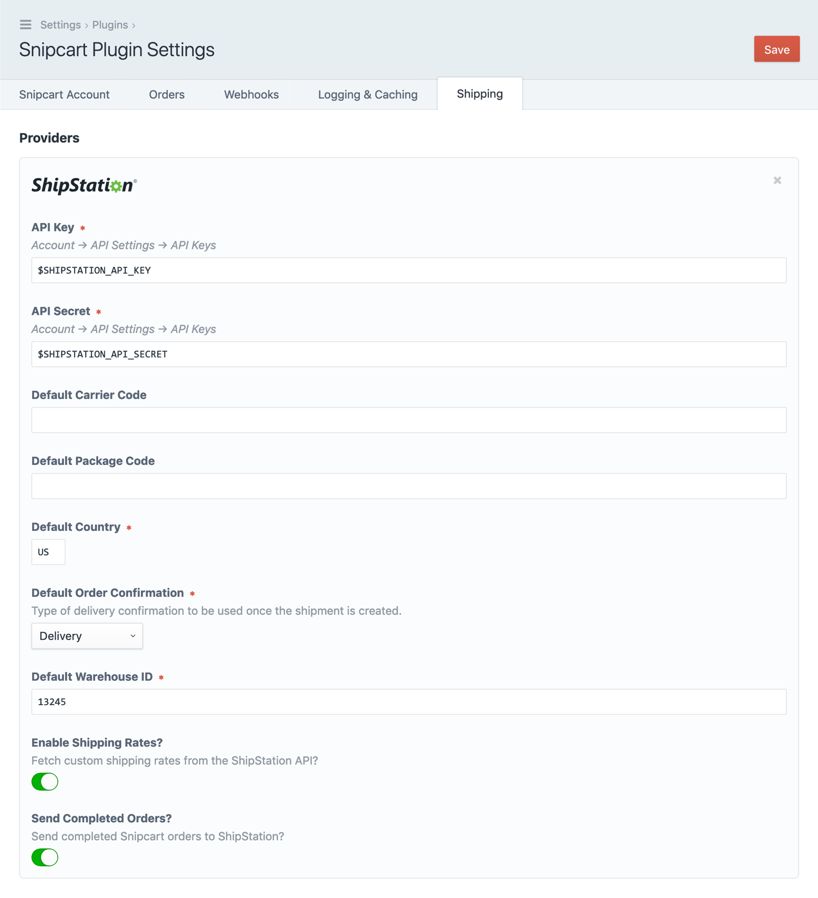

---
meta:
    - name: description
      content: Getting started with Snipcart and Craft CMS.
---

# Install & Configure the Plugin

This guide assumes you've established a Craft site and you're setting up a new store for the first time.

## Create a Snipcart Account

[Create an account](https://app.snipcart.com/register):



Grab your API keys from _Account_ → _API Keys_ to the right of the admin interface:



## Install the Plugin

**From the plugin store,** find Snipcart and choose _Install_. Done.

**From your local project,** add with:

```
composer require workingconcept/craft-snipcart
```

You can then install from the Craft CMS control panel: _Settings_ → _Plugins_, choose the gear dropdown to the right of _Snipcart_, and select _Install_.

Or install from the command line:

```
./craft install/plugin snipcart
```

## Configure the Plugin

Visit the plugin's Settings page and provide at least your public+secret API keys. If you're just getting started, you'll probably want to configure your products, orders, and webhooks.

### Snipcart Account

At minimum, you'll need to add the _Snipcart Public API Key_ and _Snipcart Secret API Key_.



:::tip
These fields support environment variables so you can keep your secrets secret!
:::

### Orders

Everything here is off by default, but you can configure a number of options that don't require any extra code unless you'd prefer your own markup, field types, and integrations.

Order Comments and gift notes are explained more in [their own section](/setup/order-fields.md), and while email notifications are ready to go you can learn more about using your own templates for them in [Custom Email Notifications](/setup/notifications.md).



### Webhooks



There's nothing to set here, but this part is important: use this URL to [link Snipcart and Craft with webhooks](/webhooks/setup.md)!

### Logging

Caching is enabled and somewhat conservative to balance timeliness and speed, but here you can adjust that and optionally turn on webhook logging [that could help with troubleshooting](/troubleshooting/logging.md).



### Shipping

If you've set up a ShipStation account and want the Snipcart plugin to get live rates or forward orders, this is where you'll need to add your credentials along with a _Ship From_ address.

:::tip
The _API Key_ and _API Secret_ fields support environment variables as well.
:::



See the [Shipments page](/shipments/overview.md) for more about how ShipStation integration works.
