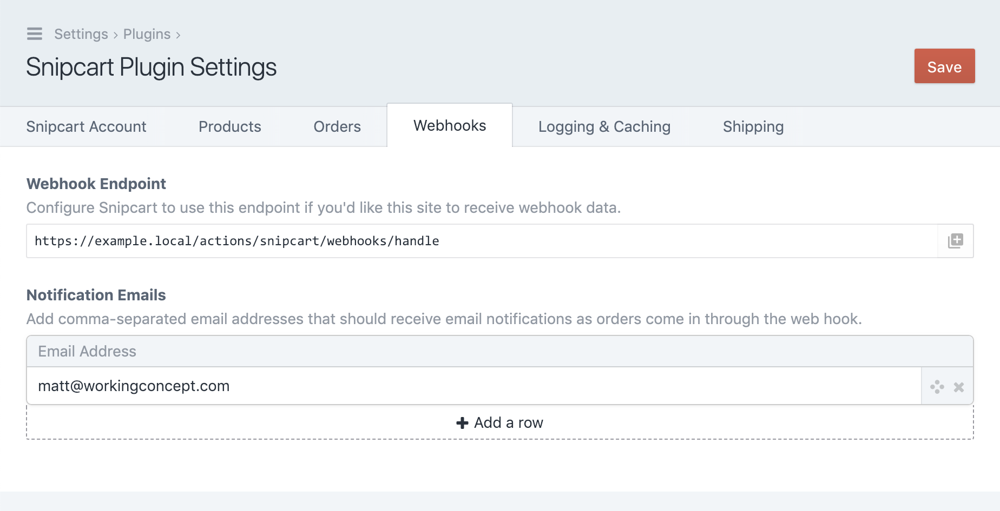
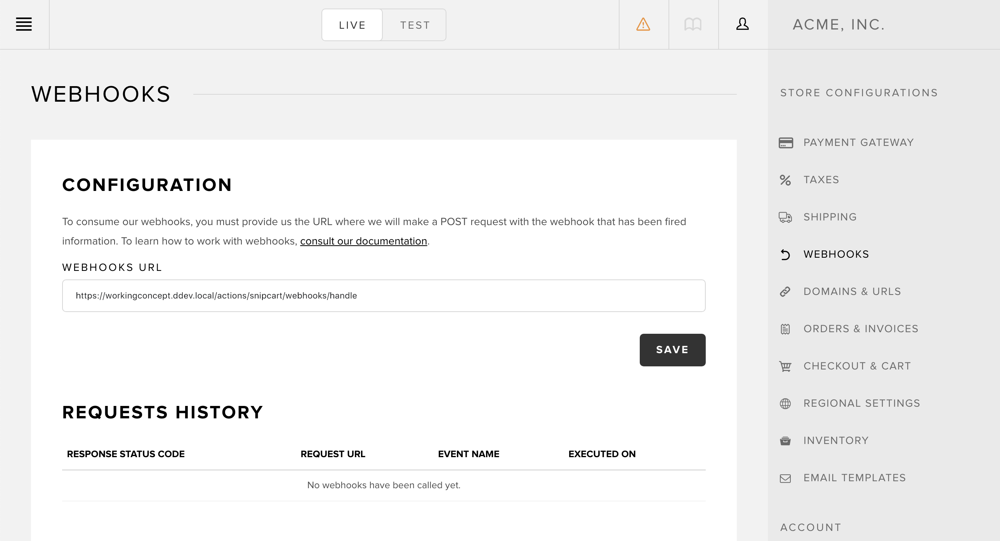

# Linking Snipcart and Craft

Get your webhook endpoint from the _Webhooks_ tab in the plugin settings:

Add it to the Webhooks URL field in Snipcart's control panel:

That's it! Now Snipcart will post data to your Craft site as stuff happens with the store. 

Webhook transactions are logged under _Requests History_ in the Snipcart control panel, so you can confirm success or investigate problems there.