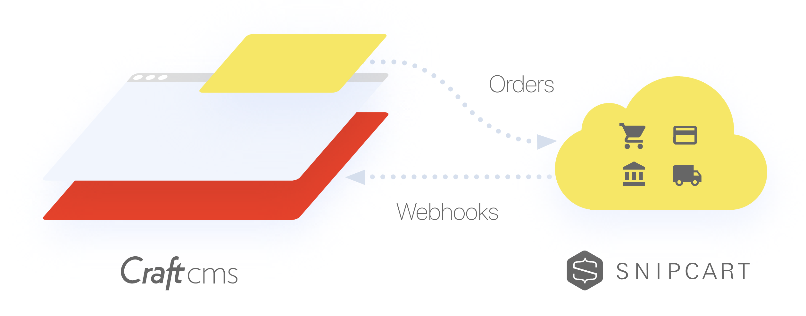

---
meta:
  - name: description
    content: When to use Snipcart webhooks with your Craft CMS site.
---

# When to Use Webhooks

Snipcart [offers a variety of webhooks](https://docs.snipcart.com/webhooks/introduction) that can send information to your Craft site immediately after different things happen. The Snipcart plugin provides native Craft Events for these so that you can write your own code to respond to things like shipping rate requests at checkout, completed orders, updates to customer information, and so on.

If you're fuzzy on the concept of webhooks, Snipcart's covered them [in a detailed blog post](https://snipcart.com/blog/what-are-webhooks-explained-example). The plugin makes all Snipcart's webhooks available within Craft, and this guide will assume you understand the concept and detail what's available and how you can hook in and add your own customizations.