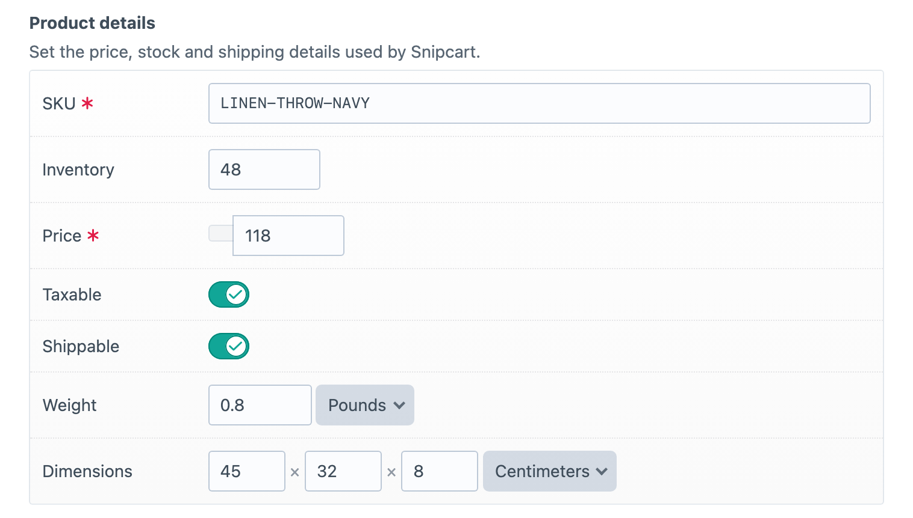
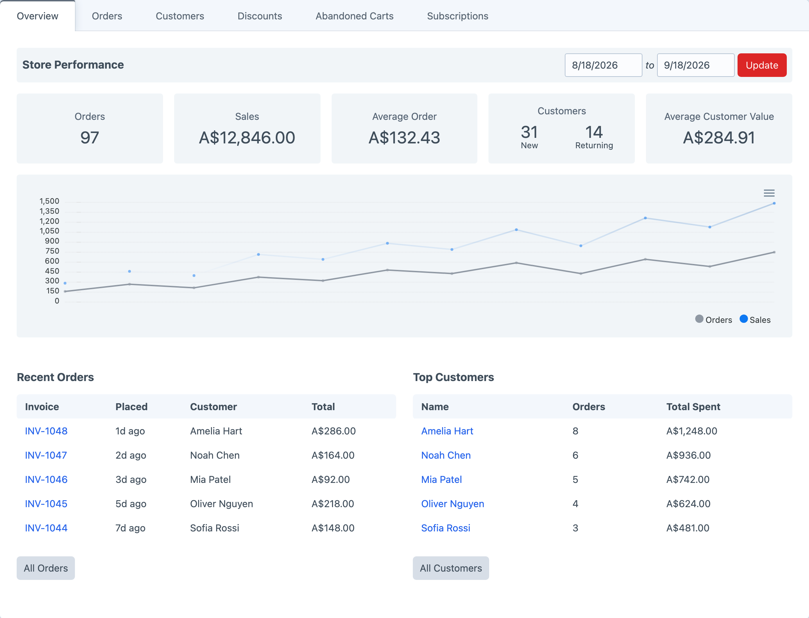
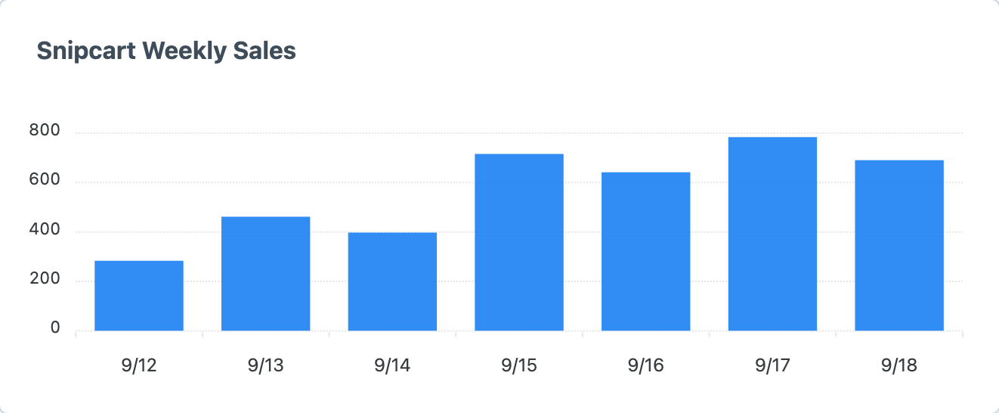
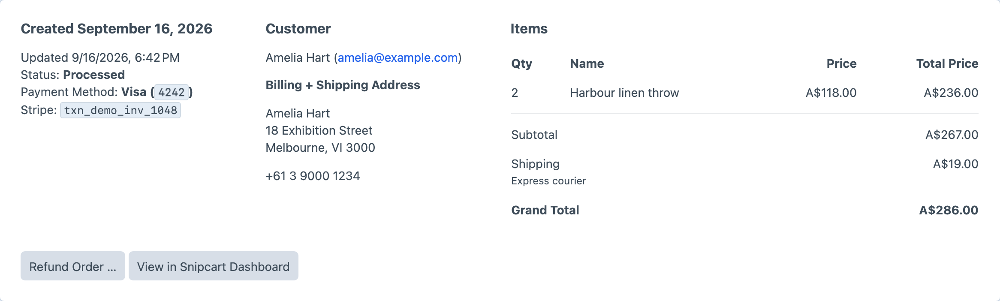
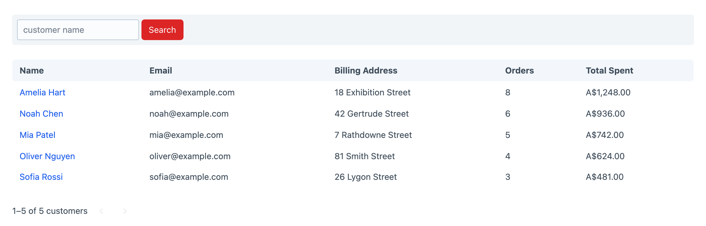

<!-- feature-intro -->
Snipcart connects Craft content to a hosted shopping cart without making editors leave Craft for everyday store operations. Add purchasable details to content, surface Snipcart data in the control panel, and keep the front end in your templates.
<!-- feature-intro-end -->

<!-- feature-section media-size="large" -->
## Craft-managed products

Use the optional product field and Twig helpers to provide Snipcart with the identifiers, prices, URLs, and options it needs. The surrounding product content and presentation stay in Craft instead of moving into a second catalogue.

<!-- feature-section-end -->

<!-- feature-section media-size="large" -->
## Store activity in Craft

See sales statistics, recent orders and leading customers together in the control panel. The overview turns day-to-day store activity into a current picture without making staff leave Craft.

<!-- feature-section-end -->

<!-- feature-section media-size="medium" -->
## Sales on the dashboard

Add the Snipcart Orders widget to Craft’s dashboard and choose the sales view and time period that matter to the team. Store performance can sit beside the other information an editor checks each day.

<!-- feature-section-end -->

<!-- feature-section media-size="large" -->
## Orders without the tab switching

Open an order in Craft to review its customer, address, payment, shipping and line items. Staff can issue refunds, jump to the matching Snipcart record and send customisable order notifications from the same operational workflow.

<!-- feature-section-end -->

<!-- feature-section media-size="large" -->
## Customer history at hand

Browse customer accounts with their billing details, order counts and lifetime spend. Subscriptions and abandoned carts are available in the same Snipcart area, keeping common commerce records close to the content team.

<!-- feature-section-end -->

<!-- feature-section -->
## Webhooks keep Craft in step

Snipcart webhooks bring completed orders, customer changes, subscriptions and checkout requests back into Craft as they happen. Product Details inventory can decrease automatically when an order completes, while native plugin events give project code a place to respond to order, status, refund, subscription and shipping-rate activity.

<!-- feature-section-end -->

<!-- feature-section -->
## Shipping and tax

Use Snipcart’s shipping and tax services during checkout, or connect ShipStation to quote shipping and forward completed orders for processing.
<!-- feature-section-end -->

<!-- feature-section -->
## Test before taking payments

Switch between separate Snipcart live and test environments once both API-key sets are configured. Test mode keeps orders away from production data, disables real payment-gateway interaction and can suppress email and fulfilment side effects while the complete checkout and webhook path is being checked.
<!-- feature-section-end -->
